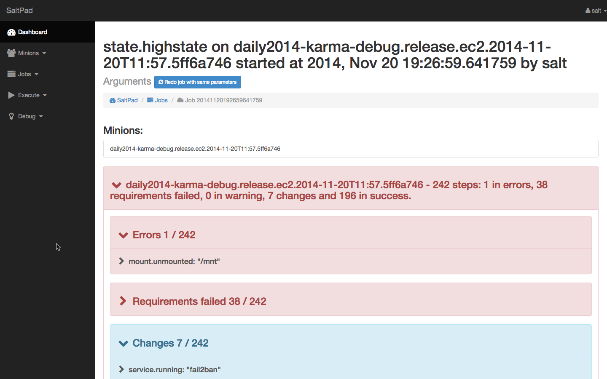

Compte rendu Salt Meetup Paris - février 2015
==============================================

:date: 2015-02-16
:tags: cr, dailymotion, 
:category: Compte Rendus
:author: David Douard
:email: david.douard@logilab.fr

La communauté Salt française (ou plutôt francilienne) s'est réunie
dans les locaux parisiens de Dailymotion_ pour son premier *meetup* de
l'année, autour de trois présentations. Voici un compte rendu (très
court) pour vous renvoyer vers les références.

Utiliser salt dans des docker
-----------------------------

David Douard de Logilab_ a fait une rapide présentation sur
l'utilisation de salt dans un conteneur docker, par exemple pour
tester des configurations salt.

Cette présentation s'est déroulée en deux parties :

* un présentation rapide de docker

* une démonstration de l'utilisation de salt dans un docker, avec :

  - la configuration requise pour lancer un salt-master local pour
    piloter les minions lancés dans des conteneurs,

  - la présentation d'un ``Dockerfile`` qui produit une image docker
    minimal, basée sur une Debian jessie, avec un salt-minion installé
    et lancé par supervisord_,

  - un exemple de test de configuration d'un apt-cacher à partir de la
    formula_ existante.

.. _formula: https://github.com/saltstack-formulas/apt-cacher-formula

Découper ses states/pillar salt
-------------------------------

Paul Tonelli, de Heuritech_, nous a fait une présentation sur la bonne
manière de sécouper ses *states* et *pillars* salt pour installer un
salt-master chez un client, et a parlé des bonnes pratiques
d'organisation du code salt.

Le support de sa présentation est disponible ici_

.. _ici: http://

SaltPad
-------

Boris Feld de Tinyclues_ nous a refait une présentation rapide de son
projet saltpad_, une interface web pour piloter salt, sous forme d'une
démonstration de l'outil.

Discussions
-----------

Des discussions se sont engagées suites à ces présentations, notament sur :

- qui utilise, et comment, les environnements_ dans une configuration salt,

- état et stabilité des modules dockerio_ récement arrivés dans salt,

- état de la salt-api_ et utilisation des ACLs_  

.. _environnements: http://docs.saltstack.com/en/latest/ref/states/top.html#environments
.. _dockerio: http://docs.saltstack.com/en/latest/ref/modules/all/salt.modules.dockerio.html#module-salt.modules.dockerio
.. _salt-api: http://docs.saltstack.com/en/latest/topics/releases/saltapi/0.8.4.html
.. _ACLs: http://docs.saltstack.com/en/latest/ref/clientacl.html

Ces discussions pourraient être le sujet de présentations et de
discussions plus avancées lors d'un prochain *meetup*.

Conclusion
----------

Merci à Dailymotion_ d'avoir acceuilli et apporté à boire, et fournie
les pizzas.

Pour le prochain meetup (mars/avril), votez pour une date sur
`framadate <https://framadate.org/4cf63j6i23vbaeem>`_ et n'hésitez pas
à inscrire une proposition de présentation ou de lieu sur le `pad
d'organisation
<http://lite4.framapad.org/p/organisation-salt-meetups>`_.

.. _Tinyclues: http://www.tinyclues.com/
.. _Dailymotion:
.. _Logilab: http://www.logilab.fr
.. _supervisord: http://supervisrd.org
.. _Heuritech: http://www.heuritech.com/
.. _saltpad: https://github.com/tinyclues/saltpad
