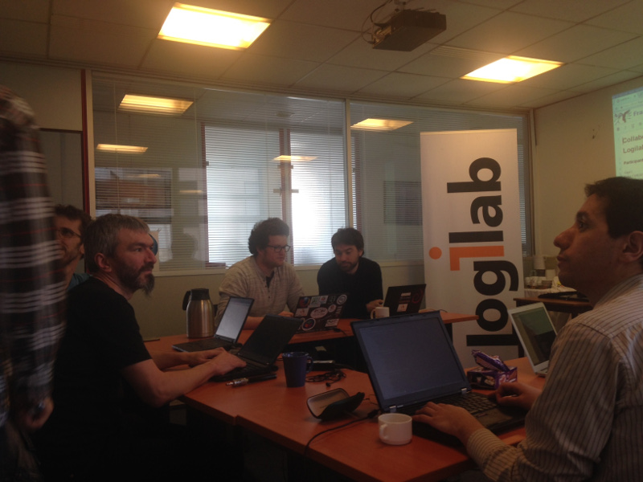

Compte rendu du sprint chez Logilab
===================================

:date: 2015-03-06
:tags: sprint, saltconf, logilab
:category: Compte Rendus
:author: Arthur Lutz
:email: arthur.lutz@logilab.fr

Juste un petit post pour dire que `le sprint sur Salt
<http://salt-fr.afpy.org/sprint-salt-en-marge-de-la-saltconf.html>`_ a
rassemblé 7 personnes dans les locaux de `Logilab
<http://www.logilab.fr>`_ et que nous en avons bien profité et réussi
à produire quelques contributions à salt (patches de codes, réflexions
sous forme de tickets, etc).

Merci à tous les participants d'être venus contribuer et échanger. 

Le compte rendu détaillé en anglais est publié sur un blog de Logilab : `A
report on the Salt Sprint 2015 in Paris
<http://www.logilab.org/288007>`_
